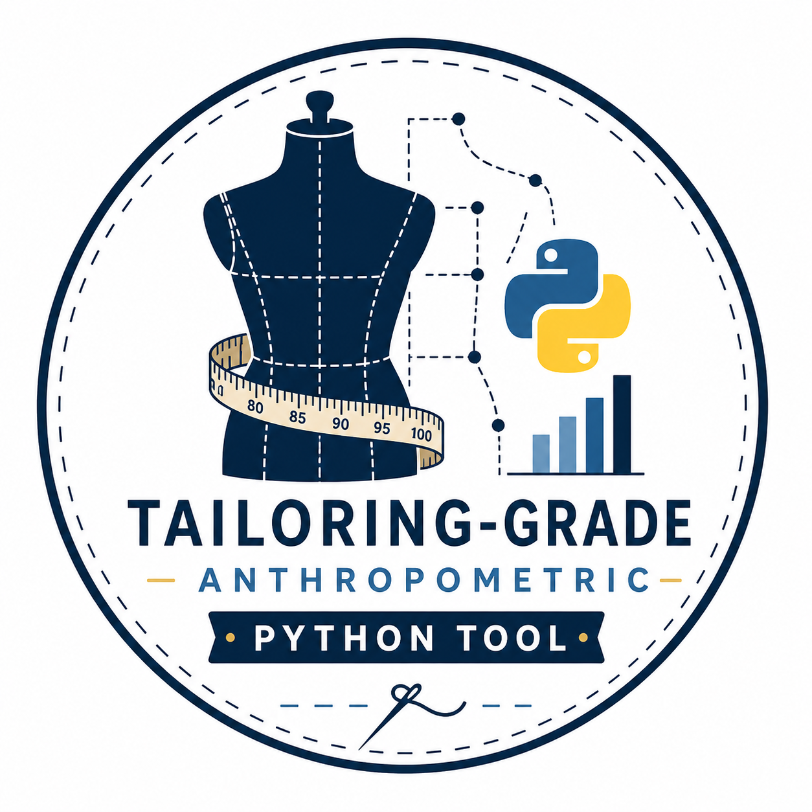

# TailorVision

**Professional-grade anthropometric body measurement extraction from two client photos.**



Built on [SMPL-X](https://github.com/vchoutas/smplx) and [SMPL-Anthropometry](https://github.com/DavidBoja/SMPL-Anthropometry). Designed for traditional garment tailoring — outputs 16 body measurements in centimetres with per-measurement confidence scores and tailoring-specific ease-allowance values.

---

## Table of Contents

1. [Features](#features)
2. [Measurements Extracted](#measurements-extracted)
3. [Recommended Python Version](#recommended-python-version)
4. [Full Setup Guide](#full-setup-guide)
   - [Step 1 — Clone the Repository](#step-1--clone-the-repository)
   - [Step 2 — Create & Activate Virtual Environment](#step-2--create--activate-virtual-environment)
   - [Step 3 — Install Python Dependencies](#step-3--install-python-dependencies)
   - [Step 4 — Download SMPL-X Model Files](#step-4--download-smpl-x-model-files-required)
   - [Step 5 — Clone SMPL-Anthropometry](#step-5--clone-smpl-anthropometry-required)
   - [Step 6 — Download MediaPipe Pose Model](#step-6--download-mediapipe-pose-model-required)
5. [Running the Pipeline](#running-the-pipeline)
   - [CLI Commands (all options)](#cli-commands)
   - [Python API](#python-api)
   - [Via python -m](#via-python--m)
6. [Output JSON Schema](#output-json-schema)
7. [Project Structure](#project-structure)
8. [Pipeline Workflow](#pipeline-workflow)
9. [Running Tests](#running-tests)
10. [Photo Guidelines](#photo-guidelines-for-best-results)
11. [Accuracy Notes](#accuracy-notes)
12. [Licensing](#licensing)
13. [Citation](#citation)

---

## Features

- Front + side image input → 16 standard body measurements in cm
- PyTorch-based SMPL-X shape fitting (dual-view reprojection + anthropometric priors)
- Three scale modes: known height (best), heuristic, normalized fallback
- Monte-Carlo uncertainty estimates per measurement
- Garment-type ease tables: traditional, suit, shirt, trousers
- Structured JSON output with warnings and quality scores
- Click CLI + Python API
- Fully typed, modular, independently testable

---

## Measurements Extracted

| Label | Key | Measurement |
|-------|-----|-------------|
| A | `head_circumference` | Head circumference |
| B | `neck_circumference` | Neck circumference |
| C | `shoulder_to_crotch_height` | Shoulder to crotch height |
| D | `chest_circumference` | Chest circumference |
| E | `waist_circumference` | Waist circumference |
| F | `hip_circumference` | Hip circumference |
| G | `wrist_right_circumference` | Wrist right circumference |
| H | `bicep_right_circumference` | Bicep right circumference |
| I | `forearm_right_circumference` | Forearm right circumference |
| J | `arm_right_length` | Arm right length |
| K | `inside_leg_height` | Inside leg height |
| L | `thigh_left_circumference` | Thigh left circumference |
| M | `calf_left_circumference` | Calf left circumference |
| N | `ankle_left_circumference` | Ankle left circumference |
| O | `shoulder_breadth` | Shoulder breadth |
| P | `height` | Full body height |

---

## Recommended Python Version

> **Python 3.10 – 3.12** is recommended for maximum compatibility.
>
> - Python **3.14** works but only the latest MediaPipe build (0.10.30+) is available for it.
> - Python **3.9** is the minimum supported version per `pyproject.toml`.
> - Python **3.13+** may have issues with some NumPy/PyTorch builds; test carefully.

To check your Python version:
```bash
python --version
```

To create a venv with a specific version (if you have multiple installed):
```bash
# Windows (PowerShell)
py -3.11 -m venv .venv

# Linux / macOS
python3.11 -m venv .venv
```

---

## Full Setup Guide

### Step 1 — Clone the Repository

```bash
git clone https://github.com/AbdallahElamin/tailoring-grade_anthropometric_Python_tool.git
cd tailoring-grade_anthropometric_Python_tool
```

---

### Step 2 — Create & Activate Virtual Environment

**Windows (PowerShell):**
```powershell
python -m venv .venv
.venv\Scripts\activate
```

**Linux / macOS:**
```bash
python3 -m venv .venv
source .venv/bin/activate
```

You should see `(.venv)` prepended to your shell prompt, confirming the environment is active.

To deactivate when you're done:
```bash
deactivate
```

---

### Step 3 — Install Python Dependencies

With the venv active:

```bash
pip install -r requirements.txt
```

**Or install the package in editable mode** (recommended for development):
```bash
pip install -e .
```

This installs the `tailor-vision` CLI entry point so you can call it directly.

**GPU support (optional):** If you have an NVIDIA GPU, replace the `torch` install with a CUDA-enabled build:
```bash
pip install torch --index-url https://download.pytorch.org/whl/cu121
```
Then set `device = "cuda"` in your `PipelineConfig`.

**Additional dependency required by SMPL-Anthropometry:**
```bash
pip install plotly
```

---

### Step 4 — Download SMPL-X Model Files *(required)*

1. Register for free at: https://smpl-x.is.tue.mpg.de
2. Download the **SMPL-X model files** (`.npz` format).
3. Place them in the following directory structure:

```
models/
└── smplx/
    ├── SMPLX_MALE.npz
    ├── SMPLX_FEMALE.npz
    └── SMPLX_NEUTRAL.npz
```

> **Note:** The `models/smplx/` directory already contains a placeholder file `PLACE_MODEL_FILES_HERE.txt` to mark the correct location.

> **License:** SMPL-X model files are under a non-commercial research license. For commercial use, contact the Max Planck Institute for Intelligent Systems.

---

### Step 5 — Clone SMPL-Anthropometry *(required)*

This third-party library handles the extraction of standard measurements from SMPL-X mesh vertices. It is **not on PyPI** and must be cloned manually:

```bash
git clone https://github.com/DavidBoja/SMPL-Anthropometry third_party/SMPL-Anthropometry
```

The measurement engine automatically adds this directory to `sys.path` at runtime, so no further configuration is needed.

Verify the clone is correct — you should have these files:
```
third_party/
└── SMPL-Anthropometry/
    ├── measure.py
    ├── measurement_definitions.py
    ├── landmark_definitions.py
    ├── utils.py
    └── ...
```

---

### Step 6 — Download MediaPipe Pose Model *(required)*

MediaPipe 0.10.30+ uses a task-based API that requires a downloaded model file. Run the following command once to download it:

**Windows (PowerShell):**
```powershell
New-Item -ItemType Directory -Force -Path models\mediapipe
Invoke-WebRequest `
  -Uri "https://storage.googleapis.com/mediapipe-models/pose_landmarker/pose_landmarker_heavy/float16/latest/pose_landmarker_heavy.task" `
  -OutFile "models\mediapipe\pose_landmarker_heavy.task"
```

**Linux / macOS:**
```bash
mkdir -p models/mediapipe
curl -o models/mediapipe/pose_landmarker_heavy.task \
  "https://storage.googleapis.com/mediapipe-models/pose_landmarker/pose_landmarker_heavy/float16/latest/pose_landmarker_heavy.task"
```

The file is approximately **29 MB**. After downloading, verify it exists at:
```
models/
└── mediapipe/
    └── pose_landmarker_heavy.task
```

---

### Final Directory Structure After Setup

```
tailoring-grade_anthropometric_Python_tool/
├── models/
│   ├── smplx/
│   │   ├── SMPLX_MALE.npz          <- downloaded from smpl-x.is.tue.mpg.de
│   │   ├── SMPLX_FEMALE.npz
│   │   └── SMPLX_NEUTRAL.npz
│   └── mediapipe/
│       └── pose_landmarker_heavy.task  <- downloaded via curl/Invoke-WebRequest
├── third_party/
│   └── SMPL-Anthropometry/         <- cloned from GitHub
├── imges/                          <- sample client images
│   ├── sample1_front.jpg
│   ├── sample1_side.jpg
│   └── ...
├── tailorvision/                   <- main Python package
├── tests/
├── requirements.txt
└── pyproject.toml
```

---

## Running the Pipeline

### CLI Commands

The main command is `tailor-vision measure` (available after `pip install -e .`) or equivalently `python -m tailorvision measure`.

#### Full Command with All Options

```bash
tailor-vision measure `
  --front   <path/to/front_image.jpg> `
  --side    <path/to/side_image.jpg>  `
  --height  <height_in_cm>            `
  --gender  <male|female|neutral>     `
  --garment <traditional|suit|shirt|trousers> `
  --output  <path/to/output.json>     `
  --device  <cpu|cuda>                `
  --model-dir <path/to/smplx/models>  `
  --no-debug                          `
  --verbose
```

Equivalently:

```bash
python -m tailorvision measure `
  --front   <path/to/front_image.jpg> `
  --side    <path/to/side_image.jpg>  `
  --height  <height_in_cm>            `
  --gender  <male|female|neutral>     `
  --garment <traditional|suit|shirt|trousers> `
  --output  <path/to/output.json>     `
  --device  <cpu|cuda>                `
  --model-dir <path/to/smplx/models>  `
  --no-debug                          `
  --verbose
```

#### All Options Reference

| Option | Required | Default | Description |
|--------|----------|---------|-------------|
| `--front` | **Yes** | — | Path to the front-view photograph |
| `--side` | **Yes** | — | Path to the side-view photograph |
| `--height` | No | `None` | Client's actual height in cm. Strongly recommended — greatly improves measurement accuracy |
| `--gender` | No | `neutral` | Body model gender: `male`, `female`, or `neutral` |
| `--garment` | No | `traditional` | Garment ease table: `traditional`, `suit`, `shirt`, or `trousers` |
| `--output` | No | `output/result.json` | Path to save the JSON result |
| `--device` | No | `cpu` | PyTorch compute device: `cpu` or `cuda` |
| `--model-dir` | No | `models/` | Override path to SMPL-X model files |
| `--no-debug` | No | `False` | Flag to suppress saving debug overlays and mesh files |
| `--verbose` / `-v` | No | `False` | Enable DEBUG-level logging for detailed stage output |

#### Example Commands

**Minimal (height unknown):**
```bash
python -m tailorvision measure `
  --front imges/sample1_front.jpg `
  --side  imges/sample1_side.jpg
```

**With known height and gender (recommended):**
```bash
python -m tailorvision measure `
  --front  imges/sample1_front.jpg `
  --side   imges/sample1_side.jpg  `
  --height 136                     `
  --gender male                    `
```

**Full options — traditional garment, save to custom path, verbose:**
```bash
python -m tailorvision measure `
  --front   imges/sample1_front.jpg `
  --side    imges/sample1_side.jpg  `
  --height  136                     `
  --gender  male                    `
  --garment traditional             `
  --output  output_sample1.json     `
  --verbose
```

**For a suit with GPU acceleration:**
```bash
python -m tailorvision measure `
  --front   client_front.jpg `
  --side    client_side.jpg  `
  --height  180              `
  --gender  male             `
  --garment suit             `
  --device  cuda             `
  --output  results/client_suit.json
```

**Suppress debug artifacts (no overlay images written):**
```bash
python -m tailorvision measure `
  --front imges/sample2_front.jpg `
  --side  imges/sample2_side.jpg  `
  --height 175                    `
  --no-debug
```

**Check version:**
```bash
tailor-vision --version
```

**Get help:**
```bash
tailor-vision --help
tailor-vision measure --help
```

---

### Python API

```python
from tailorvision import TailorVisionPipeline, PipelineConfig

# Configure the pipeline
config = PipelineConfig(
    known_height_cm=136.0,      # client's actual height in cm
    gender="male",              # "male", "female", or "neutral"
    garment_type="traditional", # ease-allowance table to use
    device="cpu",               # "cuda" for GPU
    save_debug_artifacts=True,  # writes pose overlays to output/
)

# Run the pipeline on sample images
pipeline = TailorVisionPipeline(config)
result = pipeline.run("imges/sample1_front.jpg", "imges/sample1_side.jpg")

# Access measurements (dict of str -> float, all in cm)
print(result.measurements_cm)
# {'height': 134.5, 'chest_circumference': 81.5, 'waist_circumference': 71.4, ...}

# Access confidence per measurement
print(result.measurement_confidence)
# {'chest_circumference': <ConfidenceLevel.HIGH: 'HIGH'>, ...}

# Access uncertainty (Monte-Carlo ±σ)
print(result.uncertainty_cm)
# {'chest_circumference': 0.1, 'waist_circumference': 0.1, ...}

# Access tailoring recommendations with ease applied
rec = result.tailoring_recommendations
print(rec.chest_with_ease_cm)   # e.g. 93.5 cm
print(rec.waist_with_ease_cm)   # e.g. 85.4 cm
print(rec.sleeve_length_cm)     # e.g. 44.1 cm

# Access quality and warnings
print(result.quality_scores.overall)  # 0.0 – 1.0
print(result.warnings)                # list of PipelineWarning enum values

# Save full result as JSON
result.save_json("output_sample1.json")
```

---

### Via `python -m`

```bash
python -m tailorvision measure --front imges/sample1_front.jpg --side imges/sample1_side.jpg --height 136
```

---

## Output JSON Schema

```json
{
  "body_model_type": "smplx",
  "gender": "male",
  "smplx_parameters": {
    "betas": [-0.12, 0.43, ...],
    "pose_neutralized": true,
    "gender": "male"
  },
  "measurements_cm": {
    "height": 134.5,
    "chest_circumference": 81.5,
    "waist_circumference": 71.4,
    "hip_circumference": 79.1,
    "shoulder_breadth": 27.3,
    "arm_right_length": 42.1,
    "inside_leg_height": 58.2
  },
  "measurement_confidence": {
    "chest_circumference": "HIGH",
    "waist_circumference": "HIGH"
  },
  "uncertainty_cm": {
    "chest_circumference": 0.1,
    "waist_circumference": 0.1
  },
  "scale": {
    "mode": "known_height",
    "scale_factor": 0.7844,
    "confidence": 0.97
  },
  "quality_scores": { "overall": 0.58 },
  "warnings": ["POOR_FIT_CONVERGENCE"],
  "tailoring_recommendations": {
    "garment_type": "traditional",
    "collar_size_cm": 32.9,
    "chest_with_ease_cm": 93.5,
    "waist_with_ease_cm": 85.4,
    "hip_with_ease_cm": 95.1,
    "sleeve_length_cm": 44.1,
    "inseam_cm": 61.2,
    "shoulder_seam_cm": 13.7
  }
}
```

---

## Project Structure

```
tailoring-grade_anthropometric_Python_tool/
|
|-- tailorvision/                    <- Main Python package
|   |-- __init__.py                  <- Public API: TailorVisionPipeline, PipelineConfig
|   |-- __main__.py                  <- Allows `python -m tailorvision` entry point
|   |-- pipeline.py                  <- 8-stage orchestrator: wires all stages together
|   |-- config.py                    <- PipelineConfig dataclass (all tuneable knobs)
|   |-- schema.py                    <- Pydantic v2 output models (MeasurementResult, etc.)
|   |-- exceptions.py                <- Typed exception hierarchy
|   |
|   |-- input/                       <- Stage 1-2: validation & preprocessing
|   |   |-- loader.py                <- load_image(), EXIF correction, metadata extraction
|   |   |-- validator.py             <- QualityGate: checks resolution, blur, body completeness
|   |   `-- preprocessor.py         <- Resize, optional background removal
|   |
|   |-- vision/                      <- Stage 3: pose & segmentation
|   |   |-- pose_estimator.py        <- MediaPipe PoseLandmarker (Tasks API) backend
|   |   |-- segmentor.py             <- Body silhouette extraction from pose masks
|   |   `-- keypoint_lifter.py       <- Fuses front + side keypoints into BiViewPose
|   |
|   |-- fit/                         <- Stage 4-5: SMPL-X shape fitting
|   |   |-- body_model_adapter.py    <- Wraps smplx.create(), generates T-pose vertices
|   |   |-- pose_fit_engine.py       <- PyTorch Adam optimiser over SMPL-X betas
|   |   `-- anthropometric_prior.py  <- Differentiable proportion soft constraints
|   |
|   |-- scale/                       <- Stage 6: metric scale recovery
|   |   `-- scale_recovery_engine.py <- known_height / heuristic / normalised modes
|   |
|   |-- measure/                     <- Stage 7: measurement extraction
|   |   |-- measurement_engine.py    <- Wraps SMPL-Anthropometry MeasureBody
|   |   `-- uncertainty.py           <- Monte-Carlo +-sigma estimation
|   |
|   |-- tailor/                      <- Stage 8a: garment mapping
|   |   |-- ease_tables.py           <- Per-garment ease allowance lookup tables
|   |   `-- tailoring_mapper.py      <- Applies ease, computes collar/sleeve/rise values
|   |
|   |-- quality/                     <- Stage 8b: QA reporting
|   |   `-- quality_reporter.py      <- Aggregates scores, emits pipeline warnings
|   |
|   `-- api/                         <- CLI and programmatic interface
|       `-- cli.py                   <- Click CLI entry point (tailor-vision measure ...)
|
|-- models/                          <- Model file storage (git-ignored binaries)
|   |-- smplx/
|   |   |-- SMPLX_MALE.npz          <- Download from smpl-x.is.tue.mpg.de
|   |   |-- SMPLX_FEMALE.npz
|   |   `-- SMPLX_NEUTRAL.npz
|   `-- mediapipe/
|       `-- pose_landmarker_heavy.task  <- Download via curl/Invoke-WebRequest
|
|-- third_party/                     <- External libraries (git-ignored clones)
|   `-- SMPL-Anthropometry/          <- git clone https://github.com/DavidBoja/SMPL-Anthropometry
|
|-- imges/                           <- Sample client images for testing
|   |-- sample1_front.jpg
|   |-- sample1_side.jpg
|   `-- ...
|
|-- tests/                           <- Unit tests (no model files required)
|   |-- conftest.py
|   |-- test_validator.py
|   |-- test_scale_recovery.py
|   |-- test_tailoring_mapper.py
|   |-- test_pose_estimator.py
|   |-- test_keypoint_lifter.py
|   `-- test_schema.py
|
|-- output/                          <- Auto-created; holds result.json & debug overlays
|-- requirements.txt                 <- pip dependency list
|-- pyproject.toml                   <- Package metadata, entry points, test config
`-- README.md
```

---

## Pipeline Workflow

The pipeline runs 8 sequential stages every time you call `measure`:

```
Front image                Side image
     |                          |
     +--------+    +------------+
              |    |
         [Stage 1] Input Validation
              | QualityGate checks resolution,
              | blur variance, body completeness
              |
         [Stage 2] Preprocessing
              | Resize to max 640px height,
              | optional background removal
              |
         [Stage 3] Pose Estimation + Segmentation
              | MediaPipe PoseLandmarker (33 keypoints)
              | Segmentation mask reused from pose output
              |
         [Stage 4] Keypoint Fusion
              | KeypointLifter fuses front + side views
              | into a BiViewPose with consistency score
              |
         [Stage 5] SMPL-X Shape Fitting
              | PyTorch Adam optimiser over 10 beta params
              | Minimises: reprojection loss + shape prior
              |            + anthropometric soft constraints
              |
         [Stage 6] Metric Scale Recovery
              | Mode 1 (best):  known_height / model_height
              | Mode 2:         heuristic from pixel height
              | Mode 3:         SMPL-Anthropometry normalise
              |
         [Stage 7] Measurement Extraction
              | SMPL-Anthropometry MeasureBody on T-pose verts
              | Scale applied: raw_cm * scale_factor
              | Monte-Carlo uncertainty: 5 perturbed runs
              |
         [Stage 8] Quality Report + Tailoring Map
              | QualityReporter aggregates all scores (0-1)
              | TailoringMapper applies ease-allowance tables
              | Computes collar, sleeve, rise, inseam, etc.
              |
         MeasurementResult (JSON)
```

### Scale Modes Explained

| Mode | Triggered when | Accuracy |
|------|---------------|----------|
| `known_height` | `--height` is provided | Best — all measurements scale from a real anchor |
| `heuristic` | No height given, segmentation available | Moderate — estimates height from pixel contour |
| `normalized` | Fallback | Lower — uses SMPL-Anthropometry's built-in normalisation |

---

## Running Tests

```bash
pytest tests/ -v
```

Tests that do **not** require model files (pure-logic tests):
- `test_validator.py` — image quality gate logic
- `test_scale_recovery.py` — all three scale modes with a mock adapter
- `test_tailoring_mapper.py` — ease allowance tables and derived values
- `test_pose_estimator.py` — stub pose estimator
- `test_keypoint_lifter.py` — bi-view keypoint fusion
- `test_schema.py` — Pydantic JSON serialization round-trip

Run with coverage report:
```bash
pytest tests/ -v --cov=tailorvision --cov-report=term-missing
```

---

## Photo Guidelines (for best results)

1. Stand against a **plain, light-coloured wall**.
2. Wear **fitted clothing** (leggings, fitted shirt) — loose/baggy clothing inflates circumferences.
3. Arms **slightly away from the body**, feet shoulder-width apart.
4. **Capture the entire body** from head to feet — no cropping.
5. **Natural lighting**, no strong shadows or backlighting.
6. Camera at **chest height**, approximately 2–3 metres away.
7. **Front view**: face the camera directly.
8. **Side view**: turn exactly 90° to the right.

---

## Accuracy Notes

| Scenario | Expected Accuracy |
|---|---|
| Known height + clear photos + fitted clothes | ±1–2 cm on circumferences |
| Known height + moderate clothing | ±2–4 cm |
| Unknown height, heuristic scale | ±5–15% relative (all measurements scale together) |
| Loose/baggy clothing | Circumferences may be inflated 2–8 cm; warning emitted |
| Non-upright pose | Lengths may be compressed; `BAD_POSTURE` warning emitted |
| `POOR_FIT_CONVERGENCE` warning | Optimizer did not fully converge; increase `fit_iterations` in config for better results |

> Sub-centimetre accuracy is not claimed unless `known_height_cm` is provided,
> the person wears fitted clothing, and the pose quality score is HIGH.

---

## Licensing

- **SMPL-X model files**: Non-commercial research license — see https://smpl-x.is.tue.mpg.de
- **SMPL-Anthropometry**: MIT License
- **This codebase**: MIT License

> For commercial deployment, obtain a commercial license from the Max Planck Institute
> for Intelligent Systems before using SMPL-X model files.

---

## Citation

If you use this system in research, please cite:

```bibtex
@inproceedings{SMPL-X:2019,
  title  = {Expressive Body Capture: 3D Hands, Face, and Body from a Single Image},
  author = {Pavlakos, Georgios and Choutas, Vasileios and others},
  booktitle = {CVPR},
  year   = {2019}
}
```
